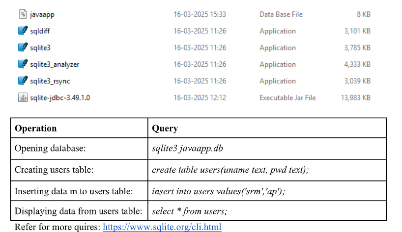
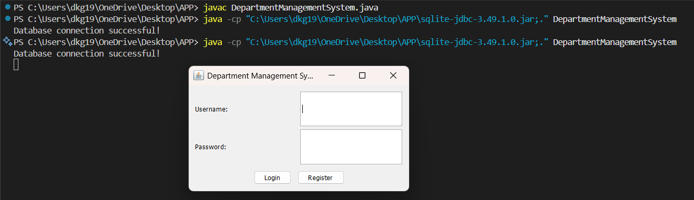

# CURD-Operations-Window-Java-

Simple Java Application Development with SQLite database connectivity
Create Apps folder on your desktop: C:\Users\SRMAP\Desktop\Apps
Where SRMAP is the username. All files need to be placed in the same “Apps” folder.
Creating SQLite database
1. Download SQLite tool kit from SQLite website: https://www.sqlite.org/2025/sqlite-tools-win-
x64-3490100.zip
2. Extract the above sqlite-tools-win-x64-3490100.zip file in “Apps” folder. This will extract the
following four application files.
3. Download sqlite-jdbc-3.49.1.0.jar (SQLite JDBC driver jar) file from Maven central
repository: https://repo1.maven.org/maven2/org/xerial/sqlite-jdbc/3.49.1.0/
4. Open command prompt by searching for “cmd” from the Start menu in windows.
5. Execute following queries to create “javaapp.db” database. “javaapp.db” file will be created in
the “Apps” folder as follows.

6. Now, press “Ctrl + Z” and then “Enter” to exit from sqlite prompt.
7. To run the code follow the below image 
